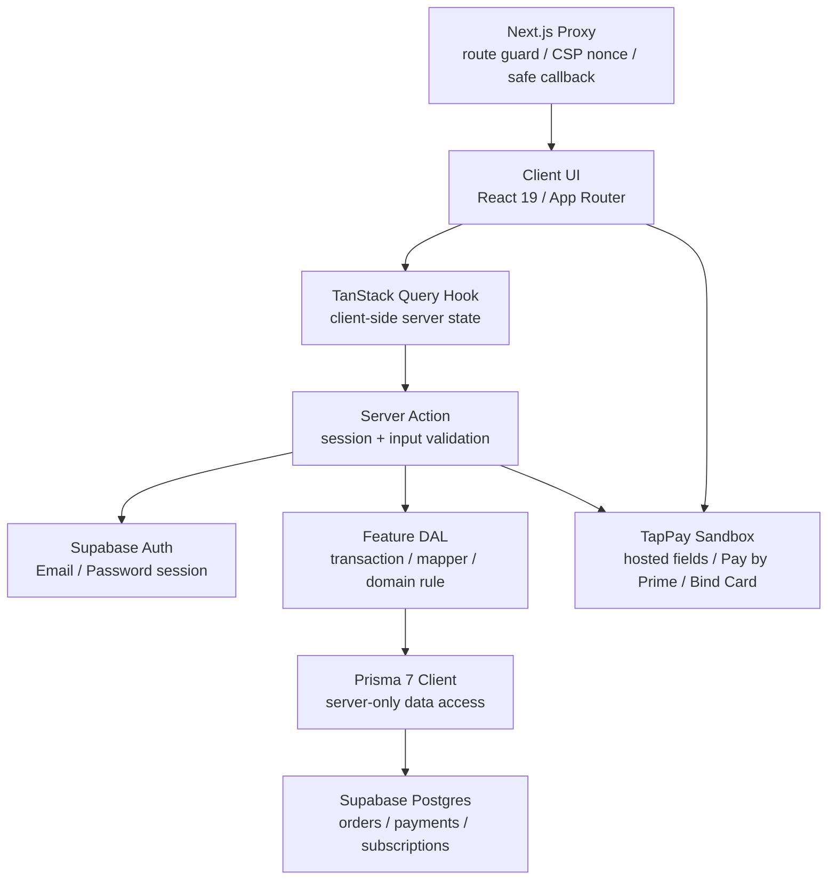
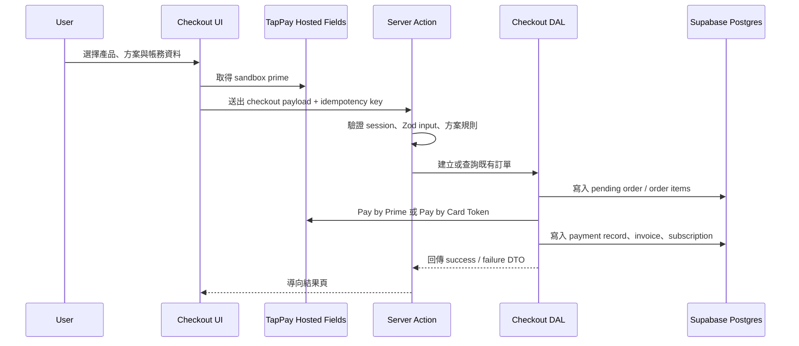

# SecureCart

SecureCart 是一個以 SaaS 訂閱、信用卡管理與 sandbox 付款流程為核心的
Next.js App Router side project。

這不是一般實體商品商城，而是一個模擬真實 SaaS 商業產品的訂閱結帳系統：
使用者可以登入、選擇方案、填寫帳務資料、透過 TapPay sandbox 完成付款，
並在受保護的帳戶頁面管理訂閱、付款方式與帳單紀錄。

```txt
A secure SaaS subscription and sandbox payment flow demo built with Next.js App Router.
```

## Demo Access

```txt
Email: demo@securecart.dev
Password: test12345
```

這組帳號僅用於公開 demo，付款流程只連接 TapPay sandbox，不會真實扣款。
請勿在 demo 環境輸入真實信用卡資料。

## 專案功能

### 公開頁面

- 首頁產品介紹與 CTA
- SaaS 方案頁，支援月繳 / 年繳方案展示
- 產品詳情頁，呈現產品價值與方案導流
- Supabase Auth Email/Password 登入

### 訂閱與結帳

- 方案選擇流程
- 帳務資料表單
- TapPay hosted fields 信用卡欄位
- TapPay sandbox prime 取得與付款模擬
- 本地訂單建立與 idempotency key 防重複送出
- sandbox 付款成功 / 失敗結果頁
- 付款交易紀錄與 sandbox trade id 關聯

### 帳戶管理

- 帳務總覽：目前方案、付款方式、帳單摘要
- 訂閱管理：查看目前訂閱狀態、升級、降級、取消訂閱
- 付款方式管理：新增信用卡、刪除信用卡、設定預設付款方式
- 帳單紀錄與訂單紀錄

### 安全與資料邊界

- 受保護路由登入檢查
- Server Component / Server Action 重新驗證 session
- `callbackUrl` 安全檢查，避免 open redirect
- CSP nonce header，降低 XSS 與 script injection 風險
- Client Component 不直接存取敏感資料或資料庫
- Prisma 作為 Supabase Postgres 業務資料的唯一查詢入口

## 技術棧

| 類型         | 技術                                           |
| ------------ | ---------------------------------------------- |
| Framework    | Next.js 16 App Router                          |
| UI Runtime   | React 19 + React Compiler                      |
| Language     | TypeScript                                     |
| Package      | pnpm                                           |
| Styling      | Tailwind CSS v4                                |
| UI Kit       | shadcn/ui、Radix UI、lucide-react              |
| Form         | React Hook Form                                |
| Validation   | Zod                                            |
| Auth         | Supabase Auth Email/Password                   |
| Database     | Supabase Postgres                              |
| ORM / DAL    | Prisma 7                                       |
| Server State | TanStack Query v5                              |
| Client State | Zustand                                        |
| Payment UI   | TapPay hosted fields                           |
| Payment Flow | TapPay sandbox Pay by Prime                    |
| Testing      | Vitest、Testing Library、Playwright、Storybook |
| Security     | CSP nonce、safe callback URL、server-only DAL  |

## 專案亮點

- **SaaS 訂閱情境完整**：涵蓋定價、結帳、付款方式、訂閱異動、取消訂閱與帳單紀錄。
- **真實金流介面但不真實扣款**：使用 TapPay hosted fields 與 sandbox API，展示安全的信用卡欄位整合方式。
- **清楚的安全邊界**：登入由 Supabase Auth 處理，業務資料只透過 Server Action / DAL / Prisma 存取。
- **server-only 資料層**：DAL 檔案集中處理資料查詢、transaction、mapper 與 domain rule，避免 Client Component 直接碰資料庫。
- **React Compiler 友善結構**：偏好 derived state、穩定資料流與純渲染，降低不必要的 memoization 負擔。
- **防重複付款設計**：結帳流程使用 idempotency key，降低重複提交造成的訂單與付款風險。
- **資安意識前端架構**：包含 CSP nonce、safe callback URL、受保護路由與 server-side session 驗證。
- **可維護的 feature 分層**：以 `features/<domain>/dal`、`actions`、`queries` 拆分資料、mutation 與 client-side server state。
- **測試覆蓋核心規則**：針對付款方式、checkout、訂閱異動、格式化工具、proxy helper 等核心邏輯建立測試。

## 架構圖





## 核心資料流

```txt
Client UI
  -> TanStack Query Hook
  -> Server Action
  -> DAL
  -> Prisma
  -> Supabase Postgres
```

主要原則：

- Client UI 只負責畫面、互動與送出請求。
- Server Action 是 mutation 的安全邊界，必須驗證 session 與輸入資料。
- DAL 只在 server side 使用，集中處理 Prisma query、mapper 與交易邏輯。
- Supabase Auth 只負責登入與 session，不作為業務資料查詢入口。
- 回傳給 Client 的資料必須是 DTO，只包含畫面需要的非敏感欄位。

## 主要路由

| Route                   | 說明                           |
| ----------------------- | ------------------------------ |
| `/`                     | 首頁                           |
| `/pricing`              | 訂閱方案頁                     |
| `/product/[id]`         | SaaS 產品詳情頁                |
| `/login`                | 登入頁                         |
| `/checkout`             | 方案確認與 TapPay sandbox 結帳 |
| `/checkout/success`     | 付款成功結果頁                 |
| `/checkout/failure`     | 付款失敗結果頁                 |
| `/account/billing`      | 帳務總覽                       |
| `/account/subscription` | 訂閱管理                       |
| `/account/payment`      | 付款方式管理                   |

## 專案結構

```txt
src/
  app/
    (public)/
      (home)/
      login/
      pricing/
      product/[id]/

    (protected)/
      checkout/
      account/
        billing/
        payment/
        subscription/

  features/
    billing/
    checkout/
    payment-methods/
    subscriptions/

  lib/
    auth/
    supabase/
    prisma.ts

  providers/
    tappay/
    AuthProvider.tsx
    QueryProvider.tsx
    ThemeProvider.tsx

  proxy/
    helpers/
    response.ts
    routes.ts
    supabaseProxy.ts
```

## 開發指令

```bash
pnpm install
pnpm dev
```

常用檢查：

```bash
pnpm lint
pnpm tsc
pnpm test:unit
pnpm test:e2e
pnpm storybook
```

Prisma：

```bash
pnpm generate
pnpm exec prisma validate
```

## TapPay 測試

本專案使用 TapPay sandbox，不接 production，也不會真實扣款。

測試卡資料可參考 TapPay 官方文件：

- https://docs.tappaysdk.com/tutorial/zh/reference.html#test-card
